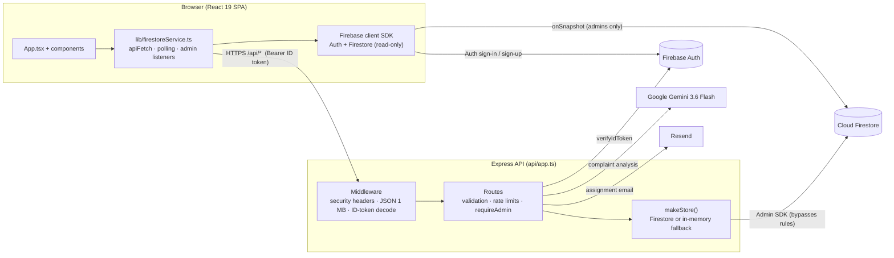

# Centivate Architecture

How the system is put together, where data lives, and how requests are authorized. For endpoint shapes see [`API_REFERENCE.md`](API_REFERENCE.md); for why features exist see [`PRD.md`](PRD.md).

## 1. System overview

There is one Express app (`api/app.ts`) with two entry points:

| Environment | Entry | What it does |
|---|---|---|
| Local dev | `server.ts` (`npm run dev`) | Mounts Vite as middleware on the same Express app, port 3000 |
| Local prod | `dist/server.cjs` (`npm start`) | Serves `dist/` statically plus the API |
| Vercel | `api/index.ts` | Exports the Express app as a serverless Node function. `vercel.json` rewrites `/api/*` to it and everything else to `index.html` |

## 2. Tech stack

| Layer | Choice |
|---|---|
| UI | React 19, TypeScript, Tailwind CSS v4 (via `@tailwindcss/vite`), `lucide-react` icons |
| Build | Vite 6 for the client, esbuild for the server bundle |
| API | Express 4 on Node, TypeScript run with `tsx` in dev |
| Data | Cloud Firestore via `firebase-admin` (server) and `firebase` (client) |
| Auth | Firebase Authentication (email/password), ID tokens verified server-side |
| AI | `@google/genai`, model `gemini-3.6-flash`, structured JSON output |
| Email | Resend (optional) |
| Tests | Vitest + jsdom |
| Hosting | Vercel |

`drizzle-orm`, `drizzle-kit` and `pg` are installed and `src/db/` holds a Postgres schema, but none of it is wired into the app. Firestore is the only database in use.

## 3. Frontend structure

There is no router. `App.tsx` owns global state and an `activeTab` value (`home | student | admin | analytics | research`) that selects the main view. Navigation is the app-wide `AppSidebar`; the `Header` holds branding, the tracking-code search and login/logout.

| Component | Role |
|---|---|
| `LandingPage` | Public overview and quick actions |
| `StudentPortal` | Complaint filing form and the user's own report history |
| `PublicTracker` | Tracking-code lookup with status timeline |
| `AdminDashboard` | Work orders, technicians, student directory; filters, assignment, resolution |
| `AnalyticsView` | Stats and SUS survey results |
| `ComplaintDetailsModal` | Full ticket, audit log, admin actions |
| `LoginModal` | Firebase sign-in and access-code signup |
| `PhotoUploadModal` | Client-side compression to under 500 KB |
| `PrintableReportModal` | Print/PDF report layout |
| `ResearchInfoModal`, `IntroOverlay` | Research context and session intro |

### Data loading

`lib/firestoreService.ts` is the only data layer.

- **Everyone:** complaints and staff are fetched from the API through `apiFetch` and re-polled every 30 seconds (`POLL_INTERVAL_MS`). The API decides how much each caller may see.
- **Admins:** additionally subscribe with Firestore `onSnapshot`, which Firestore rules allow only for admins, so dashboard updates arrive in real time.
- **Session:** `watchSession` listens to Firebase Auth and reads the user's own `users/{uid}` profile to get their role.

## 4. Backend

### Request pipeline (`api/app.ts`)

1. Security headers (`X-Content-Type-Options`, `X-Frame-Options`, `Referrer-Policy`), also set in `vercel.json`.
2. `express.json({ limit: '1mb' })`.
3. If a `Bearer` token is present and Admin credentials exist, `verifyIdToken` attaches `req.user`. An invalid token means "anonymous", not an error.
4. Per-route rate limiter and/or `requireAdmin`.
5. Handler validates input against the enums in `src/types.ts` and length caps.
6. Central error handler.

### Endpoints and guards

| Route | Guard |
|---|---|
| `GET /api/health` | Public |
| `POST /api/auth/profile` | Valid ID token + access code; failed codes are rate limited (15 min lockout) |
| `GET /api/complaints` | Public, response scoped by caller |
| `GET /api/complaints/track/:code` | Public, 60 per 10 min per IP |
| `POST /api/complaints` | Public, 20 per 10 min per IP |
| `PATCH` / `DELETE /api/complaints/:id` | `requireAdmin` |
| `GET /api/stats` | Public (aggregates only) |
| `POST /api/ai/analyze-complaint` | Public, 30 per 10 min per IP |
| `GET /api/surveys` | `requireAdmin` |
| `POST /api/surveys` | Public, 20 per 10 min per IP |
| `GET /api/staff` | Public, contact details only for admins |
| `POST` / `PATCH` / `DELETE /api/staff/:id` | `requireAdmin` |

Rate limits are in-memory per server instance (keyed by `req.ip`). On Vercel each instance has its own counters and they reset on cold start, so treat them as a first line of defense only.

### Storage abstraction

`makeStore()` wraps each collection (`complaints`, `surveys`, `staff`):

- With `FIREBASE_SERVICE_ACCOUNT_KEY` set, reads and writes go to Firestore through the Admin SDK, and write failures are returned as errors.
- Without it, the store runs in memory. Seed data from `src/data/initialData.ts` is loaded only in that mode or when `SEED_DEMO_DATA=true`. Mutation endpoints return `503` when credentials are missing.

`firebase-admin` is initialized lazily (`src/lib/firebase-admin.ts`) so a missing or bad key fails the request, not the whole function.

## 5. Data model

Types are defined in `src/types.ts`.

| Collection | Written by | Readable via client SDK | Contents |
|---|---|---|---|
| `complaints` | API only | Admins | `Complaint`: tracking code, title, description, category, building, room, priority, status, optional photo (base64), reporter fields, `ownerUid`, `assignedStaff`, resolution fields, `logs[]` audit trail, `aiAnalysis`, `isArchived` |
| `staff` | API only | Admins | `MaintenanceStaff`: name, role, specialty (a category), phone, optional email, `activeWorkload` |
| `surveys` | API only | Admins | `SurveyResponse`: respondent role, `susQ1`–`susQ5` (1–5), optional comments |
| `users` | API only (`/api/auth/profile`) | Own document, or admins | Role, full name, strand/department |
| `students` | Admins, directly from the client | Admins | `OfficialStudent` directory entries |

Enumerations:

- **Status:** `Filed` → `Pending` → `In Progress` → `Resolved`, or `Cancelled`.
- **Priority:** `Low`, `Medium`, `High`, `Urgent / Hazard`.
- **Categories (9):** Restroom & Sanitation, Classroom Furniture, HVAC & Ventilation, Lighting & Electrical, Plumbing & Water, IT & Audio-Visual, Doors, Windows & Structure, Grounds & Safety, Other Facilities.
- **Buildings (7):** Main Building A, Science & Tech Wing B, Senior High Building C, Gymnasium & Sports Complex, Library & Learning Commons, Cafeteria & Student Center, Campus Grounds.

Tracking codes look like `CENT-2026-XXXXXX` and are regenerated on collision (`generateTrackingCode`). Archiving is a soft delete (`isArchived: true`).

## 6. Security model

**Roles:** `student`, `teacher`, `admin`. Maintenance staff are records, not user accounts; they receive email only.

**Who is an admin:** `users/{uid}.role == "admin"`, or an allowlisted email address that Firebase reports as **verified**. The allowlist exists in both `api/app.ts` (`ADMIN_EMAILS`) and `firestore.rules` (`isAdmin()`) and must be kept in sync.

**How roles are granted:** the client creates the Firebase Auth account, then calls `POST /api/auth/profile` with the ID token and an access code. `SIGNUP_ACCESS_CODE` grants student or teacher; `ADMIN_SIGNUP_CODE` grants admin. Codes are compared in constant time. Clients can never write `users/*`.

**Defense in depth:**

- Firestore rules deny all client writes except the admin-only `students` collection, and deny all reads except admins and a user's own profile.
- The API scopes responses: non-admins get aggregate-only complaint data and no staff contact details. Anonymous complaints store no owner or contact details.
- Audit log entries record the verified admin's email, never a client-supplied name.
- Assignment emails HTML-escape complaint text.
- `ADMIN_DEV_BYPASS_TOKEN` (`x-admin-authorization` header) works only when `NODE_ENV !== 'production'`.

## 7. Key flows

**File a complaint**
1. `StudentPortal` validates the form and compresses the photo.
2. `POST /api/complaints`: rate limit, then enum and length validation, then the image check.
3. The server generates a tracking code, sets `ownerUid` unless the report is anonymous, and runs Gemini if configured. A detected hazard raises `Low`/`Medium` priority to `High`.
4. Saved to Firestore; the response includes the tracking code.

**Track a complaint:** `GET /api/complaints/track/:code` returns the status and timeline for that one code.

**Assign and resolve (admin)**
1. `ComplaintDetailsModal` sends `PATCH /api/complaints/:id` with a Bearer token.
2. `requireAdmin` passes; the server appends a `logs[]` entry attributed to the admin's verified email.
3. If `assignedStaff` changed and that staff member has an email, a Resend email is sent. This is best-effort and never fails the request.
4. Admin dashboards update through `onSnapshot`; other users see the change on their next 30-second poll.

**Sign up:** Firebase `createUserWithEmailAndPassword`, then `POST /api/auth/profile` with the access code, then `watchSession` reads the new role.

## 8. Configuration

| Variable | Required | Purpose |
|---|---|---|
| `FIREBASE_SERVICE_ACCOUNT_KEY` | Yes, for real data | Whole service-account JSON as one value. Without it the app runs on in-memory data and writes return `503` |
| `SIGNUP_ACCESS_CODE` | Yes, for signup | Student/teacher signup code |
| `ADMIN_SIGNUP_CODE` | Yes, for admin signup | Separate, stronger admin code |
| `GEMINI_API_KEY` | No | Enables AI analysis |
| `RESEND_API_KEY`, `RESEND_FROM_EMAIL` | No | Enables staff assignment emails |
| `SEED_DEMO_DATA` | No | `true` loads demo data into an empty store |
| `APP_URL` | No | Listed in `.env.example` (AI Studio leftover) but not read by the code |
| `ADMIN_DEV_BYPASS_TOKEN` | Local only | Dev admin bypass; never set in production |

The public Firebase web config lives in `src/lib/firebaseProjectConfig.ts` (a TS module, because Vercel's per-file function builder doesn't inline JSON imports). `firebase-applet-config.json` is the original AI Studio export and is not used.

## 9. Deployment

- `npm run build` produces `dist/` (client) and `dist/server.cjs` (server bundle).
- Vercel runs the build, serves `dist/`, and routes `/api/*` to `api/index.ts`.
- Firestore rules deploy separately: `firebase deploy --only firestore:rules`. Editing `firestore.rules` does not change production until this runs.

## 10. Known limitations and technical debt

| Item | Impact | Suggested direction |
|---|---|---|
| Photos stored as base64 inside complaint documents | Caps photos at 500 KB and grows document size | Move to Firebase Storage and store a URL |
| In-memory rate limits | Not shared across Vercel instances | Firestore- or Redis-backed limiter, or a WAF |
| 30 s polling for non-admins | Up to 30 s stale for students | Acceptable for a pilot |
| Access-code signup instead of institutional SSO | Anyone with the code can join | SSO restricted to `@cpu.edu.ph` for production |
| Admin allowlist duplicated in API and rules | Can drift | Rely on `users/{uid}.role` only |
| Unused `src/db/` (Drizzle/Postgres) and `src/data/authData.ts` | Confusing for new contributors | Delete |
| `tsconfig.json` not in `strict` mode | Type check misses null bugs | Enable `strict` gradually |
| README and API reference use some outdated building/category names | Misleading docs | Align with `src/types.ts` |
| Resend email not retried | Staff may miss an assignment | Pair with an in-app indicator |
